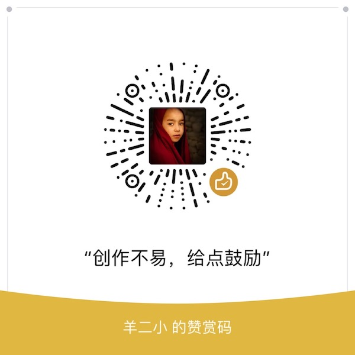

# React 弹幕 🌈🌈🌈

> 基于 CSS3 动画，使用 React 构建，可扩展，高性能。

[](https://www.npmjs.com/package/rc-bullets) [](http://npmjs.com/package/rc-bullets) [](https://twitter.com/wsygc)

## 演示地址

👉[zerosoul.github.io/rc-bullets/](https://zerosoul.github.io/rc-bullets/)


## 安装

```bash
npm install --save rc-bullets
```

## 初始化一个简单的弹幕场景

```jsx
import React, { useEffect, useState } from 'react';
import BulletScreen, { StyledBullet } from 'rc-bullets';

const headUrl='https://zerosoul.github.io/rc-bullets/assets/img/heads/girl.jpg';
export default function Demo() {
  // 弹幕屏幕
  const [screen, setScreen] = useState(null);
  // 弹幕内容
  const [bullet, setBullet] = useState('');
  useEffect(() => {
    // 给页面中某个元素初始化弹幕屏幕，一般为一个大区块
    let s = new BulletScreen('.screen');
    // or
    // let s=new BulletScreen(document.querySelector('.screen));
    setScreen(s);
  }, []);
  // 弹幕内容输入事件处理
  const handleChange = ({ target: { value } }) => {
    setBullet(value);
  };
  // 发送弹幕
  const handleSend = () => {
    if (bullet) {
      // push 纯文本
      screen.push(bullet);
      // or 使用 StyledBullet

      screen.push(
        <StyledBullet
          head={headUrl}
          msg={bullet}
          backgroundColor={'#fff'}
          size='large'
        />
      );
      // or 还可以这样使用，效果等同使用 StyledBullet 组件
      screen.push({msg:bullet,head:headUrl,color:"#eee" size="large" backgroundColor:"rgba(2,2,2,.3)"})
    }
  };
  return (
    <main>
      <div className="screen" style={{ width: '100vw', height: '80vh' }}></div>
      <input value={bullet} onChange={handleChange} />
      <button onClick={handleSend}>发送</button>
    </main>
  );
}
```

## 特性

- 支持传入 React 组件，灵活控制弹幕内容和 UI，并提供一个默认样式组件：`<StyledBullet/>`
- 弹幕屏幕管理：清屏，暂停，隐藏（后续可能会加入针对单个弹幕的控制）
- 弹幕动画参数化：运动函数（匀速/ease/步进/cubic-bezier）、时长（秒）、循环次数、延迟等
- 鼠标悬浮弹幕暂停

## 常用 API

- 初始化弹幕屏幕：`const screen = new BulletScreen(<queryString>|<HTMLElement>,[<option>])`，此处的`option`和下面的一致，偏向全局初始化，没有则使用默认值，每次发送弹幕不传则使用默认或全局设置，传了则该条弹幕覆盖全局设置。
- 发送弹幕：`const bulletId = screen.push(<string>|<ReactElement>,[<option>])`

`option`：

| 选项           | 含义               | 值类型        | 默认值      | 备注                                                                                                                      |
| -------------- | ------------------ | ------------- | ----------- | ------------------------------------------------------------------------------------------------------------------------- |
| trackHeight    | 轨道高度           | string        | 50px        | 均分轨道的高度                                                                                                            |
| onStart        | 自定义动画开始函数 | function      | null        | e.g.(bulletId,screen)=>{//do something}可以自定义一些动作，比如播放某个音效，在特定时间暂停该弹幕：screen.pause(bulletId) |
| onEnd          | 自定义动画结束函数 | function      | null        | e.g.(bulletId,screen)=>{//do something}可以自定义一些动作，比如播放某个音效                                               |
| pauseOnClick   | 鼠标点击暂停       | boolean       | false       | 再次点击继续                                                                                                              |
| pauseOnHover   | 鼠标悬停暂停       | boolean       | true        | 鼠标进入暂停，离开继续                                                                                                    |
| loopCount      | 循环次数           | number/string | 1           | 值为‘infinite’时，表示无限循环                                                                                            |
| duration       | 滚动时长           | number/string | 10          | 数字则单位为‘秒’，字符串则支持'10s'和'300ms'两种单位                                                                      |
| delay          | 延迟               | number/string | 0           | 数字则单位为‘秒’，字符串则支持'10s'和'300ms'两种单位                                                                      | [animation-delay](https://developer.mozilla.org/en-US/docs/Web/CSS/animation-delay)支持的所有值 |
| direction      | 动画方向           | string        | normal      | [animation-direction](https://developer.mozilla.org/en-US/docs/Web/CSS/animation-direction)支持的所有值                   |
| animateTimeFun | 动画函数           | string        | linear:匀速 | [animation-timing-function](https://developer.mozilla.org/en-US/docs/Web/CSS/animation-timing-function)支持的所有值       |

- 弹幕清屏：`screen.clear([<bulletId>])`，无参则清除全部
- 暂停弹幕：`screen.pause([<bulletId>])`，无参则暂停全部
- 弹幕继续：`screen.resume([<bulletId>])`，无参则继续全部
- 隐藏弹幕（滚动继续）：`screen.hide([<bulletId>])`，无参则隐藏全部
- 显示弹幕：`screen.show([<bulletId>])`，无参则显示全部
- 自带的一个弹幕样式组件：`<StyledBullet msg="<弹幕内容>" head="<头像地址>" color="<字体颜色>" backgroundColor="<背景色>" size="<尺寸:small|normal|large|huge,默认normal>">`

## TO DO

- ~~弹幕过多时，防重叠处理~~
- react hooks 版本：`useBulletScreen`

## 支持



## License

MIT © [zerosoul](https://github.com/zerosoul)
